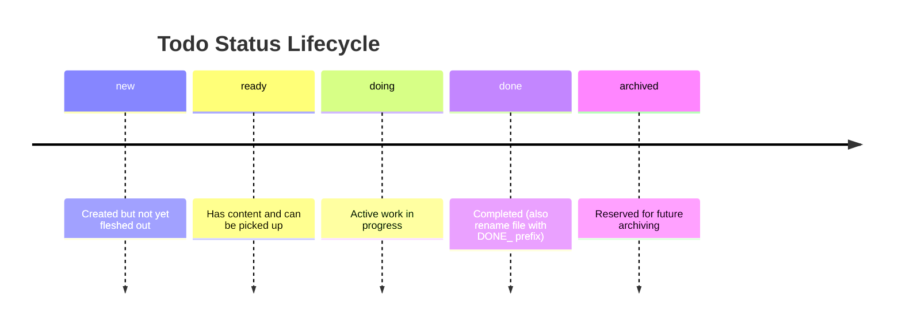

# Agent Todos

This folder contains task files for AI agents working on this project.

## Structure

- Each subdirectory represents a category of tasks
- Open task files use the naming convention: `NNNN_description.md`
- Completed task files use the naming convention: `DONE_NNNN_description.md`
- Completed tasks are prefixed with `DONE_`

## Status Lifecycle

Todo files include YAML frontmatter with a `status` field. Typical flow:

## Overview

For an up-to-date overview of all todos, see:

- [`/docs/agent-todos/TODO_OVERVIEW.md`](/docs/agent-todos/TODO_OVERVIEW.md)

## Related Skills

- `/todo-init` - Initialize the folder structure
- `/todo-creation` - Create a new todo file with sequential numbering
- `/todo-gh-issue-import` - Import GitHub issues as todo files
- `/todo-overview` - Create and update the todo overview table
- `/todo-processing` - Work with and update todo files
- `/todo-migration` - Migrate existing todos (rename prefixes, add frontmatter)

See the skill documentation for details on file format and workflow.
