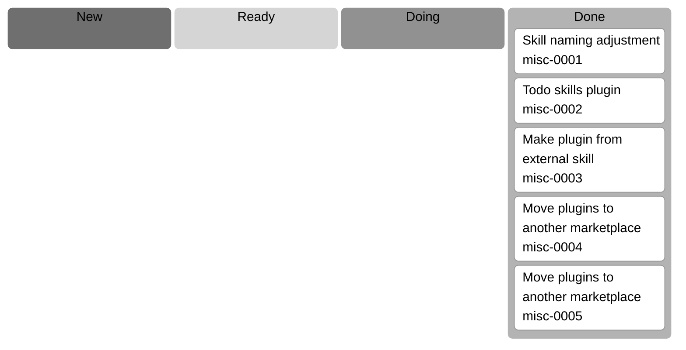

# Todo Overview

Generated on 2026-02-07 22:32:55 CET.

## Todo Kanban

## Todo List

| category | todo | status |
| --- | --- | --- |
| misc | [Skill naming adjustment](/docs/agent-todos/misc/DONE_0001_skill-naming-adjustment.md) | done |
| misc | [Todo skills plugin](/docs/agent-todos/misc/DONE_0002_todo-skills-plugin.md) | done |
| misc | [Make plugin from external skill](/docs/agent-todos/misc/DONE_0003_make-plugin-from-external-skill.md) | done |
| misc | [Move plugins to another marketplace](/docs/agent-todos/misc/DONE_0004_move-plugins-to-another-marketplace.md) | done |
| misc | [Move plugins to another marketplace](/docs/agent-todos/misc/DONE_0005_move-plugins-to-another-marketplace.md) | done |
